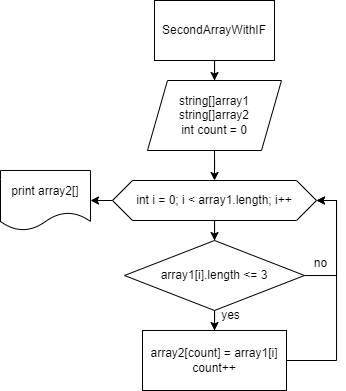

# **Итоговая контрольная работа по основному блоку.**

## __Задача__: *Написать программу, которая из имеющегося массива строк формирует новый массив из строк, длина которых меньше, либо равна 3 символам. Первоначальный массив можно ввести с клавиатуры, либо задать на старте выполнения алгоритма. При решении не рекомендуется пользоваться коллекциями, лучше обойтись исключительно массивами.*

* **Решение на блок схеме**:

* **Текстовое описание решения**:
1. _Задаем два массива одинаковой длины_.
2. _Используем метод в котором задаем условие (колличество символов в элементе массива <=3)_
    * _Если да, элемент первого массива заносится в count элемент второго массива._
    * _count увеличиваем на 1._
    * _Проверяются все элементы массива_.
3. _После заверешия цикла получаем новый массив в котором колличество символов элементов массива меньше или равно 3_.
